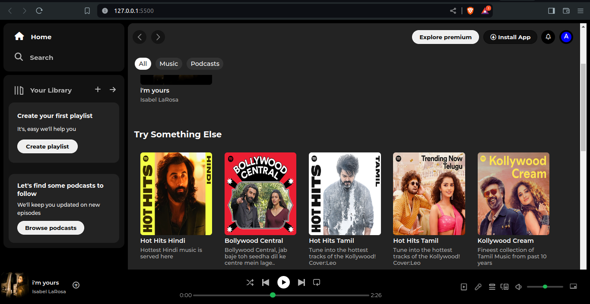

---

# Spotify UI Clone 🎵

A simple HTML and CSS clone of the Spotify user interface. This project replicates the look and feel of Spotify's web app, showcasing front-end design skills.

## Overview ℹ️

This project aims to recreate the Spotify user interface using HTML and CSS only. It does not include any functionality or backend logic but focuses purely on mimicking the visual aspects of Spotify's web application.

## Technologies Used 🛠️

- HTML
- CSS

## Features ✨

- Layout similar to Spotify's web app including navigation, player, and playlists.

## Live Demo 🌐
You can view the live demo of the Spotify UI clone at GitHub Pages.

## Installation 🚀

No installation is required for this project. Simply open the `index.html` file in a web browser to view the Spotify UI clone.

## Usage 🖥️

- Open `index.html` in any modern web browser.
- Explore the static Spotify interface without any functional interactions.

## Contributing 🤝

Contributions are not currently accepted for this project as it is a static UI clone for demonstration purposes only.

---
